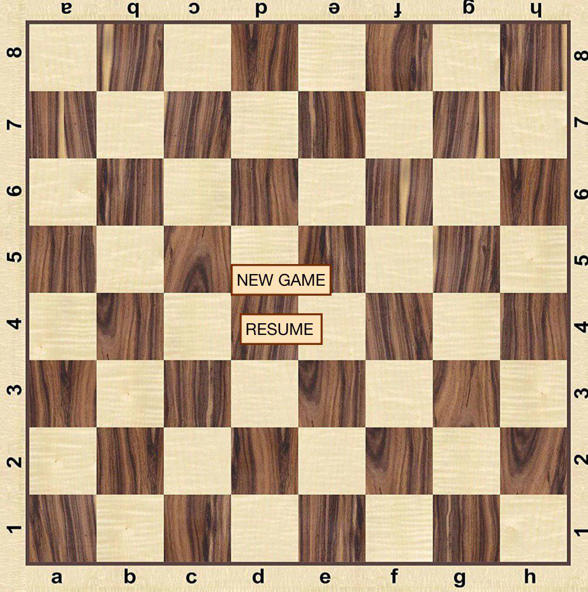
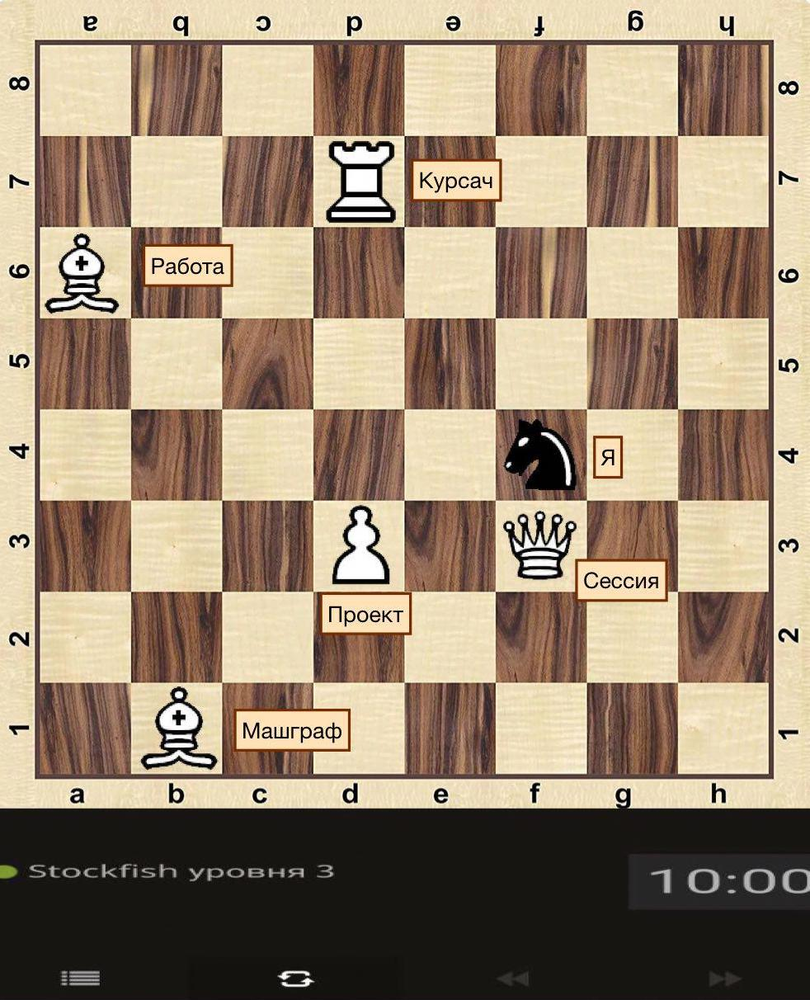

# Python Chess Game
## Описание проекта
Данный проект предполагает реализацию шахмат на языке python3.
Включая в себя реализацию ИИ, уровень которого будет оценён после окончательной реализации.
Также планируется реализация GUI с использованием библиотеки python Qt5, и web верисия игры,
которая будет реализована с использованием библиотеки Django.

## Реализовано на данный момент
На данный момент реализованы следующие вещии:

- Основной движок шахмат
- ИИ
- Интернализация
- GUI
- Документация
- Тестирование

## Текущее разделение подзадач
Никифоров Никита (RAV263):
- Основной движок шахмат
- ИИ
- Серверная часть
- Интернализация

Кукушкин Денис (p0l0satik)
- GUI
- Web интерфейс
- Написание документации
- Улучшение ИИ нейросетями

## Макет
- Макет меню
​
- Макет игрового процесса
​
## Сборка и использование
### Установка зависимостей

```
pip install -r requirements.txt
```

### Документация

```
python3 -m venv venv
. ./venv/bin/activate
python3 setup.py build
export PYTHONPATH=`pwd`/build/lib
make html
```

### Тестирование

```
python3 -m venv venv
. ./venv/bin/activate
python3 setup.py build
export PYTHONPATH=`pwd`/build/lib
pytest
```

### Сборка колеса

```
python3 -m venv venv
. ./venv/bin/activate
python3 setup.py bdist_wheel
```

### Запуск

```
python3 -m PythonChess
```

Для вывода доступных аргуметов командной строки используйте 

```
python3 -m PythonChess --help
```
